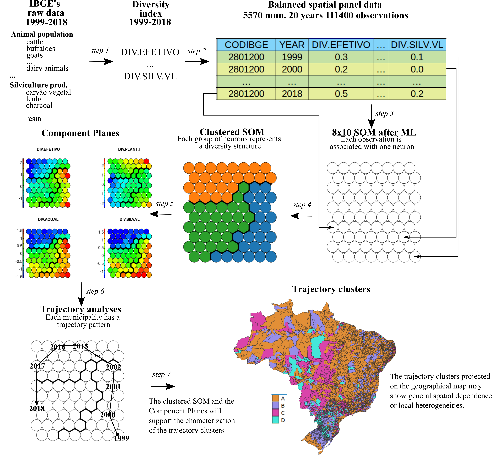
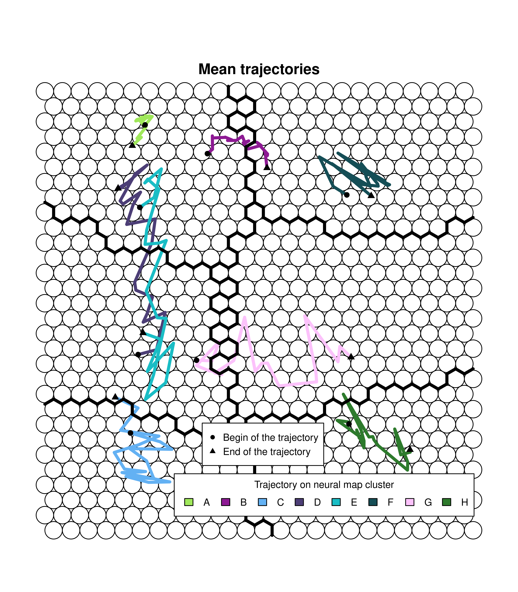
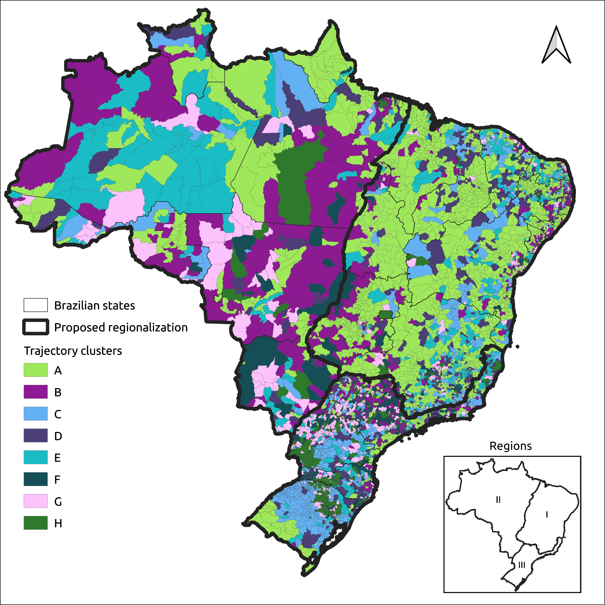
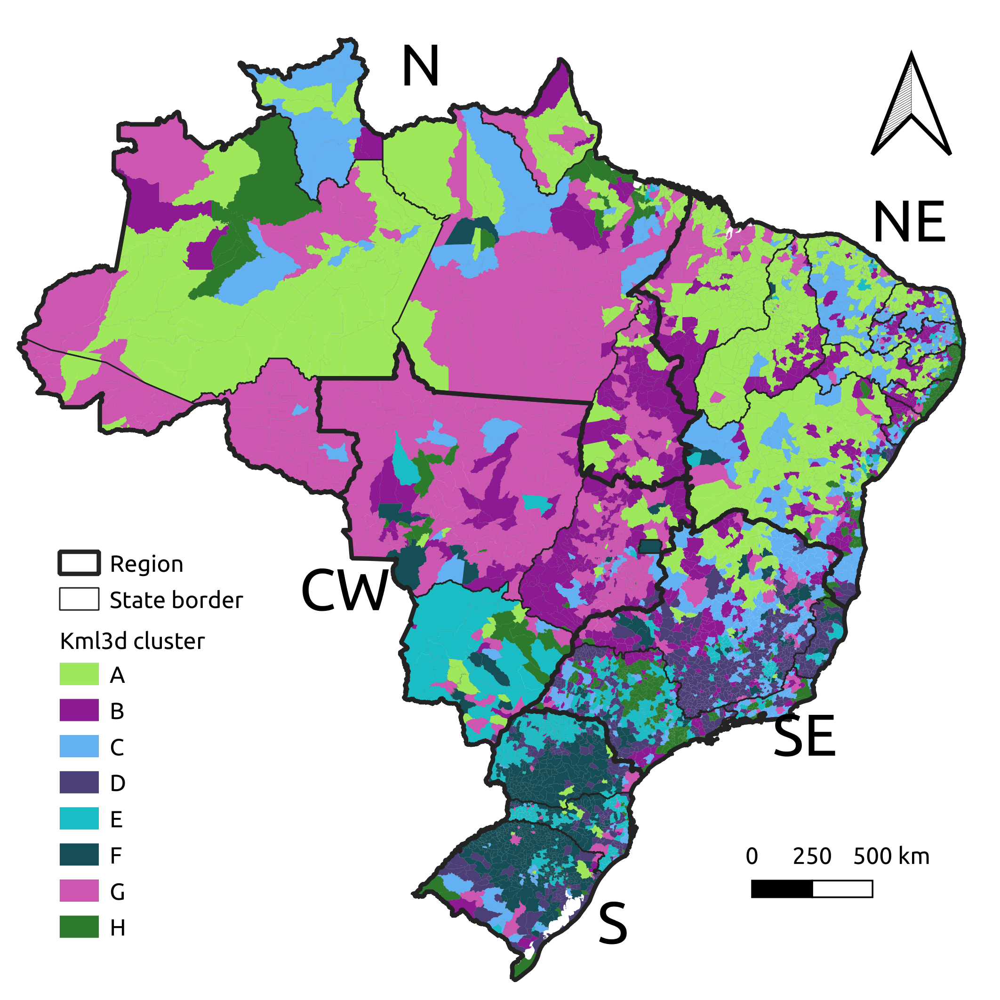
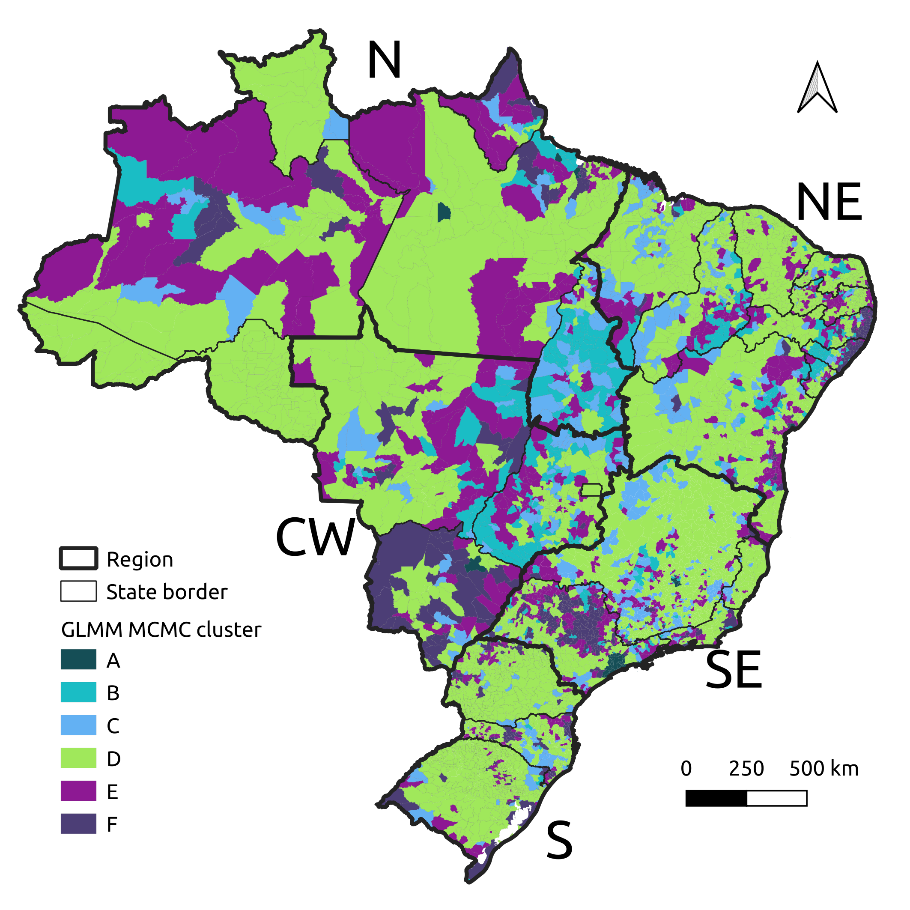

# SOMPanelData
Data and R scripts - Self-Organizing Map approach to cluster Brazilian agricultural spatiotemporal diversity - PESQBASE 2021.

[All data avialable here]. 

## Steps to cluster spatial panel data

## Steps 1 and 2 - Panel data generation

Raw data - [longitudinal.data.v.github_1.csv].

Create diversity indices: 1-CreateShannonIndices.R.

File with indices: entropy.diversity.indices.csv.

Diversity indices basic statistcs: 2-statsTable.R and 3-ExploratoryStats.R.

Statistics results: basicStats.entrpy.indices.csv.

## Step 3 - SOM creation and training
Using the SOM_PAK software: http://www.cis.hut.fi/research/som_pak/.
Generate a trained SOM.

lininit -din entropy.diversity.indices_formatoSOM_PAK.csv -cout map25x30initv1.cod -xdim 25 -ydim 30 -topol hexa -neigh gaussian.
vsom -din entropy.diversity.indices_formatoSOM_PAK.csv -cin map25x30initv1.cod -cout map25x30trainedv1.cod -rlen 100000 -alpha 0.05 -radius 30.

## Step 4 - SOM clustering
Using R's kohonen package cluster the trained SOM: 5-ClusterizacaoSOM.R.

## Step 5  - Component Planes
Using R's kohonen package generate the Component Planes: 6-ComponentPlanes.R.

## Step 6 - Cluster the municipalities following the trajectory of each observation onto the neural map
Using R's kohonen and kml packages cluster municipalities: 7-TrajectoryAnalysis.R.

## K-means clustering

## Model-based clustering

[//]: # (These are reference links used in the body of this note and get stripped out when the markdown processor does its job. There is no need to format nicely because it shouldn't be seen. Thanks SO - http://stackoverflow.com/questions/4823468/store-comments-in-markdown-syntax)

   [All data avialable here]: <https://drive.google.com/drive/folders/1VpKM5aiZMUY_L_x_ivLPWmGIsx58IBZK?usp=sharing>
   [longitudinal.data.v.github_1.csv]: <https://drive.google.com/file/d/1SV6Peo3fuRiYMoH8Jq51lLt-by_ffDKi/view?usp=sharing>
